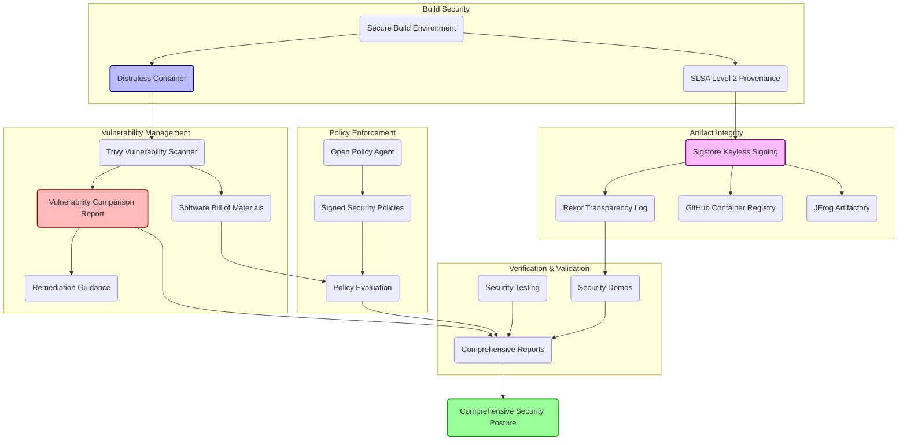

# BioGears Comprehensive Security Enhancements Report

## Overview

This document outlines the comprehensive security enhancements implemented in the BioGears pipeline. These enhancements represent a defense-in-depth approach to securing the software supply chain from source code to deployment.

## Table of Contents

- [Security Enhancements](#security-enhancements)
- [How They Work Together](#how-they-work-together)
- [Security Architecture Diagram](#security-architecture-diagram)
- [Layered Defense Strategy](#layered-defense-strategy)
- [Verification and Validation](#verification-and-validation)

## Security Enhancements

### 1. Distroless Containers

**What it does:**
- Creates minimal runtime containers without shell, package manager, or unnecessary tools
- Runs applications with non-root users by default
- Reduces attack surface significantly compared to standard base images

**Implementation details:**
- Multi-stage builds isolate build environment from runtime
- Only copies required libraries and binaries to final image
- Static linking where possible to reduce dependencies
- Numeric non-root user (65532:65532) for runtime operations

**Security impact:**
- Significantly reduces vulnerability count (quantified in comparison report)
- Eliminates entire classes of attacks (e.g., shell-based exploits)
- Prevents privilege escalation through missing package managers

### 2. Keyless Signing with Sigstore

**What it does:**
- Signs container images using OIDC identity rather than private keys
- Records all signatures in the Rekor transparency log
- Provides tamper-evident verification of image authenticity

**Implementation details:**
- Uses GitHub Actions' OIDC token to authenticate to Sigstore
- Signs both standard and distroless images
- Records entries in the public Rekor transparency log
- Supports verification without distributing public keys

**Security impact:**
- Eliminates private key management risks
- Creates auditable, tamper-evident record of all signatures
- Binds container identity to GitHub repository identity
- Prevents image spoofing and tampering

### 3. SLSA Level 2 Provenance

**What it does:**
- Generates cryptographically verifiable build provenance
- Documents who built the artifact, from what source, and how
- Attaches provenance information directly to container images

**Implementation details:**
- Creates SLSA-compliant provenance attestations
- Documents build environment, source code, and workflow
- Signs attestations with Sigstore keyless signing
- Meets SLSA Level 2 requirements for provenance

**Security impact:**
- Provides verifiable evidence of build origin
- Creates audit trail for compliance requirements
- Enables detection of unauthorized builds
- Forms foundation for higher SLSA levels

### 4. Vulnerability Scanning and Reporting

**What it does:**
- Scans container images for vulnerabilities
- Generates SBOMs detailing all components
- Provides detailed vulnerability comparison between image types
- Offers remediation guidance for critical issues

**Implementation details:**
- Uses Trivy for multi-format vulnerability scanning
- Creates CycloneDX-format SBOMs for standard and distroless images
- Generates HTML, Markdown, and step summary reports
- Includes CVE IDs, severity ratings, and remediation steps

**Security impact:**
- Enables informed security decision-making
- Identifies and prioritizes critical vulnerabilities
- Quantifies security improvement from distroless adoption
- Supports vulnerability management process

### 5. Security Policy Enforcement

**What it does:**
- Defines and enforces security policies for artifacts
- Creates signed policy bundles for distribution
- Validates artifacts against defined security criteria

**Implementation details:**
- Uses Open Policy Agent (OPA) Rego policies
- Cryptographically signs policies to prevent tampering
- Evaluates SBOMs, vulnerability scans, and attestations
- Distributes policies via OCI artifacts

**Security impact:**
- Enables automated security policy enforcement
- Creates consistent security standards across environments
- Prevents deployment of non-compliant artifacts
- Supports regulatory and compliance requirements

### 6. Multi-Registry Artifact Distribution

**What it does:**
- Publishes container images and artifacts to multiple registries
- Maintains consistent signatures and attestations across registries
- Enables registry redundancy and flexibility

**Implementation details:**
- Publishes to GitHub Container Registry and JFrog Artifactory
- Maintains identical signatures and attestations in both registries
- Uses ORAS for OCI artifact distribution
- Supports verification in either environment

**Security impact:**
- Eliminates single-registry dependency risk
- Maintains security properties across environments
- Enables flexible deployment options with consistent security
- Ensures artifact availability in case of registry issues

### 7. Comprehensive Security Testing

**What it does:**
- Performs multiple security tests on container images
- Validates configurations against security benchmarks
- Tests runtime behavior for security issues

**Implementation details:**
- Executes CIS Docker Benchmark tests
- Performs deep scanning for vulnerabilities, secrets, and misconfigurations
- Validates SBOM completeness and license compliance
- Analyzes runtime behavior for security issues

**Security impact:**
- Provides evidence of security control effectiveness
- Identifies configuration weaknesses
- Verifies security assumptions through testing
- Creates documentation for audit and compliance

### 8. Supply Chain Security Demonstrations

**What it does:**
- Creates reproducible demonstrations of security controls
- Provides educational materials on security features
- Shows how to verify artifacts and detect tampering

**Implementation details:**
- Builds tamper detection demonstrations
- Creates verification scripts for all security features
- Generates documentation explaining security benefits
- Offers practical attack simulation and detection

**Security impact:**
- Enables security training and awareness
- Validates security control effectiveness
- Provides evidence for stakeholders and auditors
- Supports incident response preparation

### 9. Automated Reporting and Documentation

**What it does:**
- Generates comprehensive security reports
- Documents security posture and improvements
- Creates evidence of security control implementation

**Implementation details:**
- Generates HTML and Markdown security reports
- Includes detailed metrics and comparisons
- Produces GitHub step summaries for immediate feedback
- Archives reports as build artifacts

**Security impact:**
- Creates evidence for compliance and audit
- Enables tracking of security improvement
- Supports security governance processes
- Provides transparency for stakeholders

## How They Work Together

These security enhancements work together to create a defense-in-depth approach to supply chain security:

1. **Secure-by-Default Foundation**: Distroless containers provide a minimal attack surface as the foundation.

2. **Cryptographic Integrity**: Sigstore keyless signing ensures all artifacts are tamper-evident and verifiable.

3. **Build Provenance**: SLSA provenance creates verifiable evidence of where, how, and by whom artifacts were built.

4. **Continuous Validation**: Vulnerability scanning and security testing continuously validate security assumptions.

5. **Policy-Driven Security**: Security policies enforce consistent standards throughout the pipeline.

6. **Transparent Operations**: Public transparency logs and comprehensive reporting create visibility.

7. **Resilient Distribution**: Multi-registry publishing ensures artifacts remain available and consistently secured.

The combination creates multiple security layers where:

- **Each layer provides defense against specific threats**
- **The compromise of any single layer doesn't compromise the entire system**
- **Security controls are complementary and reinforcing**
- **Verification is possible throughout the pipeline**

## Security Architecture Diagram



## Layered Defense Strategy

The security enhancements implement a layered defense strategy with 5 key layers:

### Layer 1: Reducing Attack Surface
**Primary components:** Distroless containers, minimal dependencies
**Defense strategy:** Eliminate unnecessary tools and entry points to reduce potential vulnerabilities

### Layer 2: Cryptographic Integrity
**Primary components:** Sigstore keyless signing, Rekor transparency log
**Defense strategy:** Ensure artifacts cannot be tampered with without detection

### Layer 3: Provenance Verification
**Primary components:** SLSA Level 2 provenance, build attestations
**Defense strategy:** Verify artifact origins and build processes

### Layer 4: Vulnerability Management
**Primary components:** Vulnerability scanning, comparison reports, remediation guidance
**Defense strategy:** Identify, prioritize, and address security vulnerabilities

### Layer 5: Policy Enforcement
**Primary components:** OPA policies, security testing
**Defense strategy:** Enforce consistent security standards automatically

## Verification and Validation

The security posture can be verified through multiple mechanisms:

1. **Cryptographic Verification**: 
   ```bash
   cosign verify --certificate-identity "https://github.com/OWNER" \
     --certificate-oidc-issuer "https://token.actions.githubusercontent.com" \
     ghcr.io/owner/biogears-hari:distroless
   ```

2. **Transparency Log Validation**:
   ```bash
   cosign triangulate ghcr.io/owner/biogears-hari:distroless
   # Check entry in https://rekor.tlog.dev
   ```

3. **Provenance Verification**:
   ```bash
   cosign verify-attestation --type slsaprovenance \
     --certificate-identity "https://github.com/OWNER" \
     --certificate-oidc-issuer "https://token.actions.githubusercontent.com" \
     ghcr.io/owner/biogears-hari:distroless
   ```

4. **Vulnerability Assessment**:
   ```bash
   trivy image --format table ghcr.io/owner/biogears-hari:distroless
   ```

5. **Security Policy Validation**:
   ```bash
   opa eval -i sbom.json -d policy.rego "data.sbom.valid"
   ```

These verification mechanisms provide comprehensive validation of the security enhancements and demonstrate the defense-in-depth approach to supply chain security. 